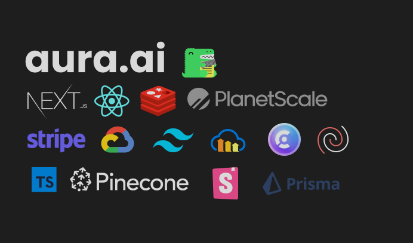

Creating a multi-technology application requires a lot of hard work &
and it's a annoying process. But while building this I learned a lot of technolgies which are revolutionary. In today's rapidly evolving tech landscape, creating an AI-powered chatbot has become an exciting and transformative endeavor. Not only does it offer a chance to develop innovative solutions, but it also provides a golden opportunity to dive deep into cutting-edge technologies. In this blog, I'll share my journey of creating an AI chatbot application and how I learned to wield world-class technologies like Next.js, Prisma, Redis, and more.

## Choosing the Tech Stack
As I started on this journey, I knew that the tech stack would play a pivotal role in the success of my project. I decided to leverage NextJS as my frontend with React.

With the powerful Next [Approuter](https://nextjs.org/docs/app), building multipage applications have become easier. Seamless navigations, image upload, memory cache store and much more!, with tailwind CSS, cloudinary and upstash-redis.For more stack info visit the **github repo** .

## Model

Choosing a AI model is also crucial for the development of this app. For this I used [llama-2-13b-chat](https://replicate.com/a16z-infra/llama-2-13b-chat).I am planning to improve it and use the [llama-2-70b] in the upcoming quarter!
Visit [replicate](https://replicate.com) to learn about how to use efficient models for your app in web browser without the need of separate graphic units for development.

:::tip Contributing

Feel free to contribute and enhance this app and make it better for upcoming future deployments. This is just a project and I have no other intentions regarding this!

:::

